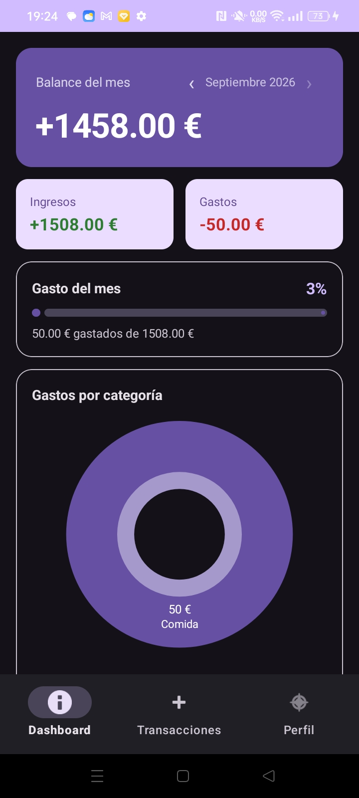
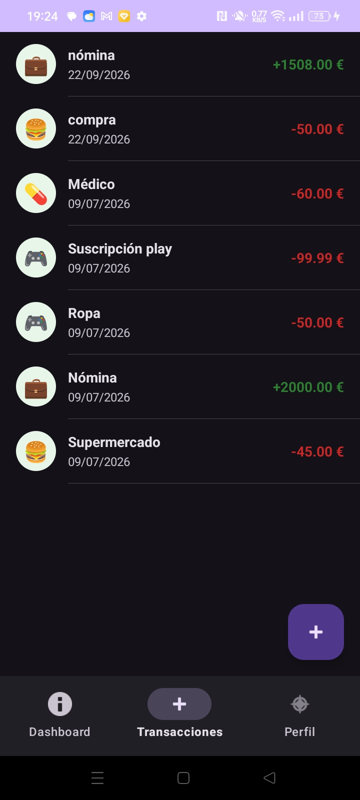
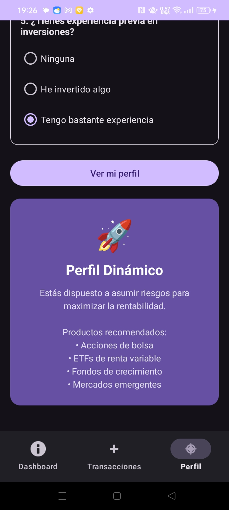

# FinTrack

Android app to track personal income and expenses. Built as a portfolio project in my second year of DAM (Desarrollo de Aplicaciones Multiplataforma).

## Screenshots

| Dashboard | Transactions | Investor Profile |
|:---------:|:------------:|:----------------:|
|  |  |  |

## Features

- Add income and expenses with category and date
- Monthly balance with navigation between past months
- Spending progress bar relative to monthly income
- Pie chart showing expenses by category — tap a slice to see individual transactions
- Full transaction history
- Investor profile questionnaire — 5 questions, 3 possible results (Conservative, Moderate, Dynamic)

## Tech Stack

- **Language:** Kotlin
- **Architecture:** MVVM — ViewModel + LiveData + MediatorLiveData
- **Database:** Room (local SQLite)
- **UI:** Material Design 3, ViewBinding
- **Charts:** MPAndroidChart

## Build

Open in Android Studio (Electric Eel or later) and run on an emulator or physical device (API 26+). No external services or API keys needed.
